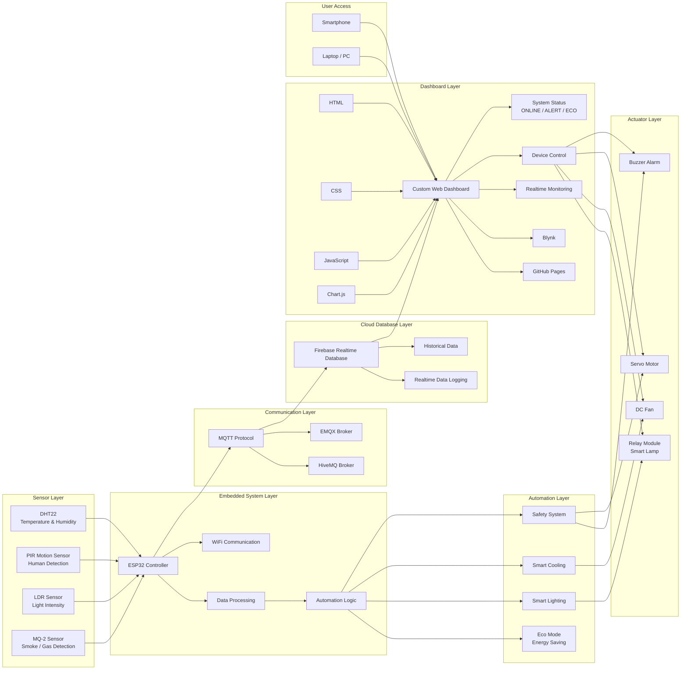

```mermaid
flowchart LR

%% =========================================================
%% SMART BUILDING IOT SYSTEM
%% =========================================================

%% =========================
%% SENSOR LAYER
%% =========================
subgraph SENSOR["Sensor Layer"]

    DHT["DHT22<br/>Temperature & Humidity"]
    PIR["PIR Motion Sensor<br/>Human Detection"]
    LDR["LDR Sensor<br/>Light Intensity"]
    MQ2["MQ-2 Sensor<br/>Smoke / Gas Detection"]

end

%% =========================
%% ESP32 CONTROLLER
%% =========================
subgraph CONTROL["Embedded System Layer"]

    ESP["ESP32 Controller"]

    PROCESS["Data Processing"]
    AUTO["Automation Logic"]
    WIFI["WiFi Communication"]

end

%% =========================
%% AUTOMATION SYSTEM
%% =========================
subgraph RULE["Automation Layer"]

    ECO["Eco Mode<br/>Energy Saving"]

    LIGHT["Smart Lighting"]

    COOL["Smart Cooling"]

    SAFE["Safety System"]

end

%% =========================
%% COMMUNICATION
%% =========================
subgraph COMM["Communication Layer"]

    MQTT["MQTT Protocol"]

    HIVE["HiveMQ Broker"]

    EMQX["EMQX Broker"]

end

%% =========================
%% DATABASE LAYER
%% =========================
subgraph DB["Cloud Database Layer"]

    FIREBASE["Firebase Realtime Database"]

    LOG["Realtime Data Logging"]

    HISTORY["Historical Data"]

end

%% =========================
%% DASHBOARD
%% =========================
subgraph DASHBOARD["Dashboard Layer"]

    WEB["Custom Web Dashboard"]

    GITHUB["GitHub Pages"]

    BLYNK["Blynk"]

    HTML["HTML"]

    CSS["CSS"]

    JS["JavaScript"]

    CHART["Chart.js"]

    MONITOR["Realtime Monitoring"]

    CONTROLDEVICE["Device Control"]

    STATUS["System Status<br/>ONLINE / ALERT / ECO"]

end

%% =========================
%% ACTUATOR LAYER
%% =========================
subgraph ACT["Actuator Layer"]

    RELAY["Relay Module<br/>Smart Lamp"]

    FAN["DC Fan"]

    SERVO["Servo Motor"]

    BUZZER["Buzzer Alarm"]

end

%% =========================
%% USER ACCESS
%% =========================
subgraph USER["User Access"]

    PHONE["Smartphone"]

    LAPTOP["Laptop / PC"]

end

%% =========================================================
%% CONNECTION FLOW
%% =========================================================

DHT --> ESP
PIR --> ESP
LDR --> ESP
MQ2 --> ESP

ESP --> PROCESS
PROCESS --> AUTO
ESP --> WIFI

AUTO --> ECO
AUTO --> LIGHT
AUTO --> COOL
AUTO --> SAFE

ESP --> MQTT

MQTT --> HIVE
MQTT --> EMQX

MQTT --> FIREBASE

FIREBASE --> LOG
FIREBASE --> HISTORY

FIREBASE --> WEB

WEB --> GITHUB
WEB --> BLYNK

HTML --> WEB
CSS --> WEB
JS --> WEB
CHART --> WEB

WEB --> MONITOR
WEB --> CONTROLDEVICE
WEB --> STATUS

CONTROLDEVICE --> RELAY
CONTROLDEVICE --> FAN
CONTROLDEVICE --> SERVO
CONTROLDEVICE --> BUZZER

LIGHT --> RELAY

COOL --> FAN

SAFE --> BUZZER
SAFE --> SERVO

PHONE --> WEB
LAPTOP --> WEB

```